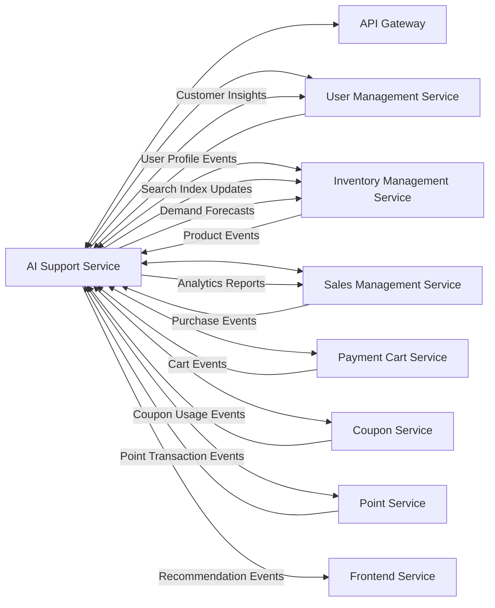

## 5. API設計

### 主なREST APIエンドポイント

#### レコメンド管理API
| メソッド | パス | 説明 |
|----------|------|------|
| GET | /api/v1/recommendations/{userId} | パーソナライズ推薦取得 |
| GET | /api/v1/recommendations/similar/{productId} | 類似商品推薦取得 |
| GET | /api/v1/recommendations/trending | トレンド商品取得 |
| POST | /api/v1/recommendations/feedback | 推薦フィードバック登録 |
| PUT | /api/v1/recommendations/{recommendationId}/click | 推薦クリック記録 |
| GET | /api/v1/recommendations/history/{userId} | 推薦履歴取得 |
| POST | /api/v1/recommendations/batch | バッチ推薦生成 |
| GET | /api/v1/recommendations/performance | 推薦パフォーマンス指標取得 |

#### 検索強化API
| メソッド | パス | 説明 |
|----------|------|------|
| GET | /api/v1/search | AI強化検索 |
| GET | /api/v1/search/autocomplete | オートコンプリート取得 |
| POST | /api/v1/search/semantic | セマンティック検索 |
| GET | /api/v1/search/suggestions | 検索サジェスト取得 |
| POST | /api/v1/search/feedback | 検索フィードバック登録 |
| GET | /api/v1/search/analytics | 検索分析取得 |
| POST | /api/v1/search/reindex | 検索インデックス再構築 |

#### チャットサポートAPI
| メソッド | パス | 説明 |
|----------|------|------|
| POST | /api/v1/chat/session | 新規チャットセッション作成 |
| POST | /api/v1/chat/message | チャットメッセージ送信 |
| GET | /api/v1/chat/history/{sessionId} | チャット履歴取得 |
| PUT | /api/v1/chat/session/{sessionId}/status | セッション状態更新 |
| POST | /api/v1/chat/feedback | チャットフィードバック登録 |
| GET | /api/v1/chat/sessions/{userId} | ユーザーのチャットセッション一覧取得 |
| POST | /api/v1/chat/escalate | オペレーターへのエスカレーション |
| GET | /api/v1/chat/intents | サポート可能な意図一覧取得 |

#### 分析・予測API
| メソッド | パス | 説明 |
|----------|------|------|
| GET | /api/v1/analytics/user-behavior | ユーザー行動分析取得 |
| GET | /api/v1/analytics/sales-forecast | 売上予測取得 |
| GET | /api/v1/analytics/product-performance | 商品パフォーマンス分析取得 |
| GET | /api/v1/analytics/trends | 市場トレンド取得 |
| GET | /api/v1/analytics/customer-segments | 顧客セグメント取得 |
| POST | /api/v1/analytics/custom-report | カスタム分析レポート生成 |
| GET | /api/v1/analytics/dashboard | ダッシュボードデータ取得 |

#### モデル管理API
| メソッド | パス | 説明 |
|----------|------|------|
| POST | /api/v1/models/train | モデル学習開始 |
| GET | /api/v1/models/status/{trainingId} | 学習状況取得 |
| GET | /api/v1/models/versions | モデルバージョン一覧取得 |
| POST | /api/v1/models/deploy | モデルデプロイ |
| GET | /api/v1/models/performance | モデルパフォーマンス指標取得 |
| POST | /api/v1/models/a-b-test | A/Bテスト開始 |

### 実装メモ
- 推薦APIは協調フィルタリング・コンテンツベース・ハイブリッド手法を活用
- チャットAPIはWebSocketによるリアルタイム通信対応
- 検索はセマンティック理解・クエリ拡張を活用
- モデル学習はデータドリフト検知やパフォーマンス低下時に自動再学習
- 認証はJWT、分析系は管理者権限必須
- レートリミット・キャッシュ戦略も実装
## データベーススキーマ（主なコレクション例）

- user_profiles: ユーザー情報・嗜好・履歴
    - ユーザーID、嗜好、購入履歴、閲覧履歴、検索履歴、カテゴリ嗜好、ロイヤルティランク、行動メトリクス、デバイス情報など
- chat_sessions: チャットセッション情報
    - セッションID、ユーザーID、種別、状態、満足度、担当者、会話履歴、タグ、メタデータなど
- recommendations: レコメンド情報
    - レコメンドID、ユーザーID、タイプ、商品リスト、信頼度、クリック・購入履歴、理由、アルゴリズム、特徴量など
- search_analytics: 検索分析情報
    - 検索ID、ユーザーID、クエリ、カテゴリ、結果数、クリック履歴、デバイス、レスポンスタイムなど
- model_training: モデル学習履歴
    - 学習ID、モデル種別、アルゴリズム、パラメータ、メトリクス、バージョン、特徴量、学習データサイズなど
- demand_forecasts: 需要予測情報
    - 予測ID、商品ID、カテゴリ、期間、予測需要、実績、精度、特徴量、信頼区間、外部要因など
# AIサポートサービス - 詳細設計ドキュメント
## 4. データモデル

### エンティティリレーション図（ER図）

ユーザープロファイル、チャットセッション、レコメンデーション、検索分析、モデル学習、需要予測など、AIサポートサービスで扱う主要なエンティティの関係を示します。

（ER図は原文のmermaid記法を参照）

各エンティティの主な属性例：
- UserProfile: ユーザーID、嗜好、購入履歴、閲覧履歴、検索履歴、ロイヤルティランク、行動メトリクスなど
- ChatSession: セッションID、ユーザーID、セッション種別、状態、満足度、会話履歴など
- Recommendation: レコメンドID、ユーザーID、タイプ、商品リスト、信頼度、理由、アルゴリズムなど
- ProductRecommendation: 商品ID、スコア、理由、特徴量など
- SearchAnalytics: 検索ID、ユーザーID、クエリ、カテゴリ、結果数、デバイス、レスポンスタイムなど
- ModelTraining: 学習ID、モデル種別、アルゴリズム、パラメータ、メトリクス、バージョンなど
- DemandForecast: 予測ID、商品ID、期間、予測需要、実績、精度、特徴量など

## サービス情報

| 項目 | 値 |
|------|----|
| サービス名 | ai-support-service |
| ポート | 8087 |
| データベース | MongoDB (skishop_ai) |
| キャッシュ | Redis |
| フレームワーク | Spring Boot 3.2.3 + LangChain4j 1.1.0 |
| Javaバージョン | 21 |
| アーキテクチャ | マイクロサービス（イベント駆動・AI/MLパイプライン）|

## 技術スタック

| 分類 | 技術 | バージョン | 用途 |
|------|------|------------|------|
| 実行環境 | Java | 21 | メイン言語 |
| フレームワーク | Spring Boot | 3.2.3 | アプリ基盤 |
| AI/ML | LangChain4j | 1.1.0 | AI/LLM連携 |
| DB | MongoDB | 7.0+ | 非構造AIデータ保存 |
| キャッシュ | Redis | 7.2+ | キャッシュ・セッション |
| メッセージキュー | Apache Kafka | 7.4.0 | イベントストリーム |
| ベクタDB | Azure Cognitive Search | 最新 | セマンティック検索 |
| LLM | Azure OpenAI | GPT-4o | 自然言語処理 |
| 埋め込み | text-embedding-3-small | 最新 | テキスト埋め込み |
| 検索 | Azure Cognitive Search | 最新 | 検索エンジン |
| ML基盤 | Weka | 3.8.6 | 機械学習 |
| ビルド | Maven | 3.9+ | 依存管理・ビルド |
| コンテナ | Docker | 最新 | コンテナ化 |
## 1. 概要

AIサポートサービスは、Azure OpenAI Serviceなどの先進的なAI技術を活用し、スキーショップECプラットフォーム向けにインテリジェントなサポート機能を提供するマイクロサービスです。パーソナライズされた商品推薦、AI検索機能、インテリジェントなチャットボットカスタマーサービス、需要予測・分析、ユーザー行動分析などを担います。他のマイクロサービスと連携し、顧客体験の向上や業務最適化、意思決定のためのインサイト提供を実現します。本サービスはプラットフォームの頭脳として、機械学習モデルを活用し、顧客の嗜好理解・トレンド予測・パーソナライズ体験の提供を行います。

## 2. 技術スタック

### 開発環境
- **言語**: Java 21 (LTS)
- **フレームワーク**: Spring Boot 3.2.3
- **ビルドツール**: Maven 3.9.x
- **コンテナ**: Docker 25.x
- **テスト**: JUnit 5.10.1, Spring Boot Test, Testcontainers 1.19.3

### 本番環境
- Azure Container Apps
- Azure OpenAI Service (GPT-4o, GPT-3.5-turbo)
- Azure Cognitive Search
- MongoDB Atlas
- Azure Redis Cache

### 主なライブラリとバージョン

| ライブラリ | バージョン | 用途 |
|------------|------------|------|
| langchain4j-azure-open-ai | 1.1.0-rc1 | Azure OpenAI連携 |
| langchain4j-spring-boot-starter | 1.1.0-beta7 | LangChain4j Spring Boot連携 |
| langchain4j-embeddings-all-minilm-l6-v2 | 1.1.0-beta7 | 埋め込みモデル |
| langchain4j-easy-rag | 1.1.0-beta7 | RAG (検索拡張生成) |
| spring-boot-starter-web | 3.2.3 | REST APIエンドポイント |
| spring-boot-starter-data-mongodb | 3.2.3 | MongoDBデータアクセス |
| spring-boot-starter-data-redis | 3.2.3 | Redisキャッシュ |
| spring-boot-starter-validation | 3.2.3 | 入力バリデーション |
| spring-boot-starter-security | 3.2.3 | セキュリティ設定 |
| spring-boot-starter-actuator | 3.2.3 | ヘルスチェック・メトリクス |
| spring-cloud-starter-stream-kafka | 4.1.0 | イベント配信/購読 |
| spring-cloud-starter-circuitbreaker-resilience4j | 3.0.3 | サーキットブレーカー |
| spring-boot-starter-cache | 3.2.3 | キャッシュ機能 |
| spring-retry | 2.0.5 | APIリトライ機構 |
| springdoc-openapi-starter-webmvc-ui | 2.3.0 | APIドキュメント |
| mapstruct | 1.5.5.Final | オブジェクトマッピング |
| lombok | 1.18.30 | ボイラープレート削減 |
| micrometer-registry-prometheus | 1.12.2 | メトリクス収集 |
| azure-identity | 1.11.1 | Azure認証 |
| azure-security-keyvault-secrets | 4.6.2 | Azure Key Vault連携 |
| azure-ai-textanalytics | 5.2.4 | テキスト分析（感情分析等）|
| azure-search-documents | 11.5.8 | Azure Cognitive Search連携 |
| commons-math3 | 3.6.1 | 機械学習用数値計算 |
| weka | 3.8.6 | 機械学習アルゴリズム |

## 3. システムアーキテクチャ

### コンポーネント構成図

```mermaid
graph TB
    subgraph "AI Support Service"
        direction TB
        API[REST API Controller] --> CHAT[Chat Service]
        API --> RECOM[Recommendation Service]
        API --> SEARCH[Search Service]
        API --> FORECAST[Forecast Service]
        API --> ANALYTICS[Analytics Service]
        
        CHAT --> CHAT_ASSISTANT[AI Chat Assistant]
        RECOM --> RECOM_ASSISTANT[Recommendation Assistant]
        SEARCH --> SEARCH_ASSISTANT[Search Enhancement Assistant]
        FORECAST --> FORECAST_ASSISTANT[Demand Forecast Assistant]
        ANALYTICS --> ANALYTICS_ENGINE[Analytics Engine]
        
        CHAT_ASSISTANT --> LANGCHAIN[LangChain4j Service]
        RECOM_ASSISTANT --> LANGCHAIN
        SEARCH_ASSISTANT --> LANGCHAIN
        FORECAST_ASSISTANT --> LANGCHAIN
        
        LANGCHAIN --> OPENAI[Azure OpenAI Service]
        
        CHAT --> CHAT_REPO[Chat Repository]
        RECOM --> RECOM_REPO[Recommendation Repository]
        ANALYTICS --> ANALYTICS_REPO[Analytics Repository]
        FORECAST --> FORECAST_REPO[Forecast Repository]
        SEARCH --> SEARCH_REPO[Search Analytics Repository]
        
        CHAT_REPO --> MONGODB[(MongoDB)]
        RECOM_REPO --> MONGODB
        ANALYTICS_REPO --> MONGODB
        FORECAST_REPO --> MONGODB
        SEARCH_REPO --> MONGODB
        
        RECOM --> VECTOR_DB[Azure Cognitive Search]
        SEARCH --> VECTOR_DB
        FORECAST --> VECTOR_DB
        
        CACHE[Redis Cache] --> CHAT
        CACHE --> RECOM
        CACHE --> SEARCH
        CACHE --> FORECAST
        CACHE --> ANALYTICS
        
        EVENT[Event Publisher Service] --> KAFKA[Kafka]
        RECOM --> EVENT
        CHAT --> EVENT
        ANALYTICS --> EVENT
        FORECAST --> EVENT
        SEARCH --> EVENT
        
        ML_ENGINE[ML Model Engine] --> RECOM
        ML_ENGINE --> FORECAST
        ML_ENGINE --> ANALYTICS
        
        EMBEDDING_SERVICE[Embedding Service] --> VECTOR_DB
        EMBEDDING_SERVICE --> SEARCH
        EMBEDDING_SERVICE --> RECOM
    end
    
    %% 外部システム連携
    API --> GATEWAY[API Gateway]
    EVENT --> INVENTORY[Inventory Management Service]
    EVENT --> SALES[Sales Management Service]
    EVENT --> USER[User Management Service]
    EVENT --> PAYMENT[Payment Cart Service]
```

### マイクロサービス関連図

