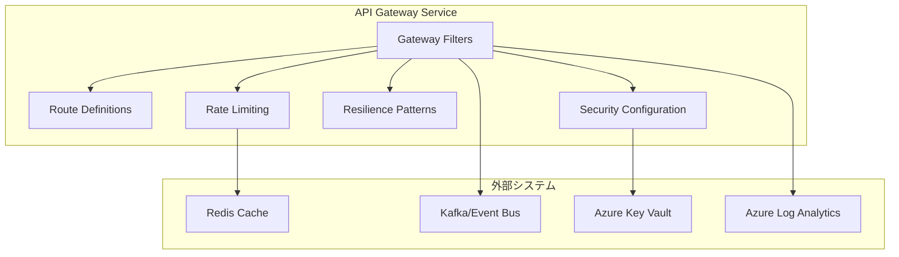
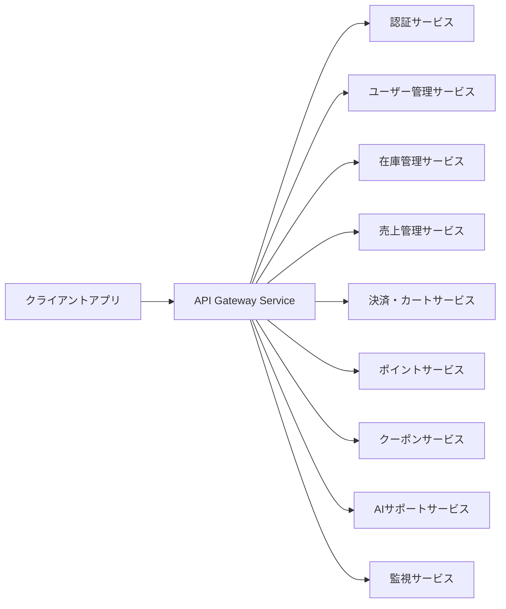

# APIゲートウェイサービス - 詳細設計ドキュメント

## 1. 概要

APIゲートウェイサービスは、スキーショップECプラットフォームのバックエンドサービスへの統一的な入口となるマイクロサービスです。リクエストルーティング、認証・認可、レートリミット、サーキットブレーカー、APIドキュメント集約などを中央レイヤーで提供します。リアクティブプログラミングを採用し、高スループット・高スケーラビリティを実現します。

## 2. 技術スタック

### 開発環境
- **言語**: Java 21 (LTS)
- **フレームワーク**: Spring Boot 3.2.3, Spring Cloud Gateway 4.1.1
- **ビルドツール**: Maven 3.9.x
- **コンテナ**: Docker 25.x
- **テスト**: JUnit 5.10.1, Spring Boot Test, Testcontainers 1.19.3

### 本番環境
- Azure Container Apps
- Azure API Management
- Azure Redis Cache
- Azure Key Vault

### 主なライブラリとバージョン
| ライブラリ | バージョン | 用途 |
|------------|------------|------|
| spring-cloud-starter-gateway | 4.1.1 | ゲートウェイ機能 |
| spring-cloud-starter-circuitbreaker-reactor-resilience4j | 3.0.3 | サーキットブレーカー |
| spring-boot-starter-oauth2-resource-server | 3.2.3 | JWT/OAuth2認証 |
| spring-boot-starter-data-redis-reactive | 3.2.3 | Redisレートリミット |
| spring-boot-starter-actuator | 3.2.3 | ヘルスチェック・メトリクス |
| micrometer-registry-prometheus | 1.12.2 | メトリクス収集 |
| micrometer-tracing-bridge-brave | 1.2.2 | 分散トレーシング |
| spring-cloud-starter-stream-kafka | 4.1.0 | イベントストリーミング |
| azure-identity | 1.11.1 | Azure認証 |
| azure-security-keyvault-secrets | 4.6.2 | Key Vault連携 |
| springdoc-openapi-starter-webflux-ui | 2.3.0 | APIドキュメント |
| logback-json-classic | 0.1.5 | JSONログ |
| lombok | 1.18.30 | ボイラープレート削減 |

## 3. システムアーキテクチャ

### コンポーネント構成図

### マイクロサービス関連図

