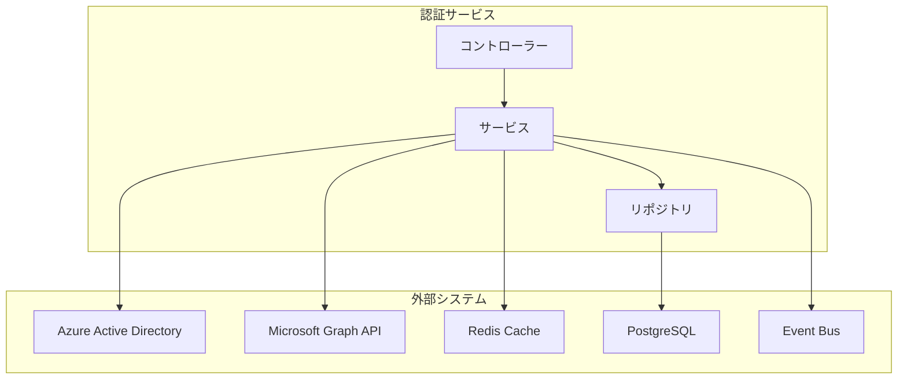
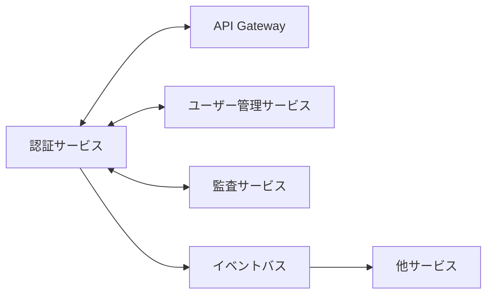

# 認証サービス - 詳細設計ドキュメント

## 1. 概要

認証サービスは、スキーショップECプラットフォームのユーザー認証・認可を担うマイクロサービスです。Microsoft Entra ID連携によるセキュアな認証、JWTトークン管理、ユーザーセッション管理、ロールベースアクセス制御を提供します。OAuth2/OpenID Connectフロー、ユーザー登録、多要素認証（MFA）、包括的なセキュリティ監視も対応しています。

## 2. 技術スタック

### 開発環境
- **言語**: Java 21 (LTS)
- **フレームワーク**: Spring Boot 3.2.3
- **ビルドツール**: Maven 3.9.x
- **コンテナ**: Docker 25.x
- **テスト**: JUnit 5.10.1, Spring Boot Test, Testcontainers 1.19.3

### 本番環境
- Azure Container Apps
- Azure Database for PostgreSQL
- Azure Service Bus / Apache Kafka
- Azure Active Directory (Entra ID)

### 主なライブラリとバージョン
| ライブラリ | バージョン | 用途 |
|------------|------------|------|
| spring-boot-starter-web | 3.2.3 | REST APIエンドポイント |
| spring-boot-starter-data-jpa | 3.2.3 | JPAデータアクセス |
| spring-boot-starter-security | 3.2.3 | セキュリティ設定 |
| spring-boot-starter-oauth2-client | 3.2.3 | OAuth2クライアント対応 |
| spring-cloud-azure-starter-active-directory | 5.8.0 | Azure AD連携 |
| spring-boot-starter-data-redis | 3.2.3 | Redisセッション保存 |
| spring-boot-starter-validation | 3.2.3 | 入力バリデーション |
| spring-boot-starter-actuator | 3.2.3 | ヘルスチェック・メトリクス |
| spring-kafka | 3.1.0 | イベント配信・購読 |
| azure-servicebus-jms-spring-boot-starter | 4.15.0 | Azure Service Bus連携 |
| hibernate-core | 6.4.1 | ORMマッピング |
| postgresql | 42.7.1 | PostgreSQL JDBCドライバ |
| jjwt-api | 0.12.3 | JWTトークン管理 |
| lombok | 1.18.30 | ボイラープレート削減 |
| micrometer-registry-prometheus | 1.12.2 | メトリクス収集 |
| springdoc-openapi-starter-webmvc-ui | 2.3.0 | APIドキュメント |
| azure-identity | 1.11.1 | Azure認証 |
| mapstruct | 1.5.5.Final | オブジェクトマッピング |

## 3. システムアーキテクチャ

### コンポーネント構成図

### マイクロサービス関連図

