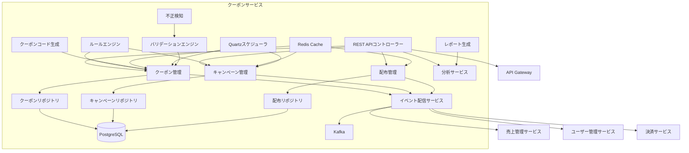
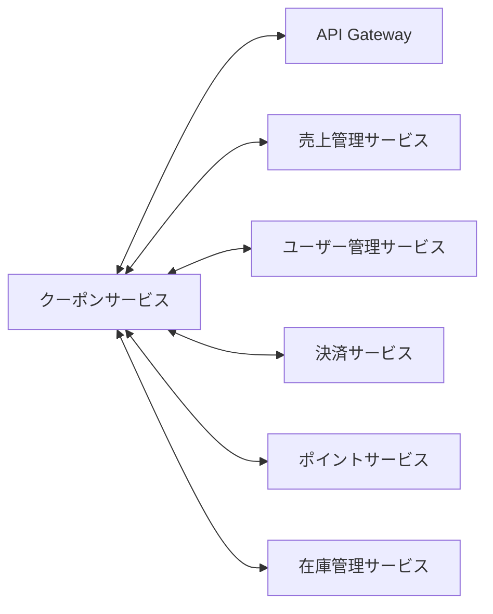

# クーポンサービス - 詳細設計ドキュメント

## 1. 概要

クーポンサービスは、スキーショップECプラットフォームのプロモーションキャンペーン、割引クーポン、バウチャー管理を担うマイクロサービスです。クーポンの作成・検証・利用・配布・分析までの全ライフサイクルを管理します。マーケティング担当者がターゲットユーザー向けに高度な割引施策や利用状況トラッキングを実現できます。

### サービスの主な責務
- **クーポン管理**: 作成・検証・利用・ライフサイクル管理
- **キャンペーン管理**: プロモーションキャンペーンの作成・スケジューリング・モニタリング
- **配布エンジン**: 対象ユーザーへの自動・手動クーポン配布
- **ルールエンジン**: 複雑なビジネスルールによるクーポン適格判定
- **利用状況トラッキング**: リアルタイム利用分析・不正検知
- **分析・レポート**: キャンペーン効果分析・最適化インサイト
- **イベント連携**: 注文・決済・ユーザー管理サービスとの連携

## 2. 技術スタック

### 開発環境
- **言語**: Java 21 (LTS)
- **フレームワーク**: Spring Boot 3.2.3
- **ビルドツール**: Maven 3.9.x
- **コンテナ**: Docker 25.x
- **テスト**: JUnit 5.10.1, Spring Boot Test, Testcontainers 1.19.3

### 本番環境
- Azure Container Apps
- Azure Database for PostgreSQL
- Azure Cache for Redis
- Azure Service Bus (Kafka)

### 主なライブラリとバージョン
| ライブラリ | バージョン | 用途 |
|------------|------------|------|
| spring-boot-starter-web | 3.2.3 | REST APIエンドポイント |
| spring-boot-starter-data-jpa | 3.2.3 | JPAデータアクセス |
| spring-boot-starter-data-redis | 3.2.3 | Redisキャッシュ |
| spring-boot-starter-validation | 3.2.3 | 入力バリデーション |
| spring-boot-starter-security | 3.2.3 | セキュリティ設定 |
| spring-boot-starter-actuator | 3.2.3 | ヘルスチェック・メトリクス |
| spring-boot-starter-quartz | 3.2.3 | スケジューリング |
| spring-cloud-starter-stream-kafka | 2023.0.0 | イベント配信・購読 |
| postgresql | 42.7.1 | PostgreSQLドライバ |
| flyway-core | 9.5.1 | DBマイグレーション |
| hypersistence-utils-hibernate-62 | 3.5.1 | Hibernate用JSONサポート |
| mapstruct | 1.5.5.Final | オブジェクトマッピング |
| lombok | 1.18.30 | ボイラープレート削減 |
| micrometer-registry-prometheus | 1.12.2 | メトリクス収集 |
| springdoc-openapi-starter-webmvc-ui | 2.3.0 | APIドキュメント |
| azure-identity | 1.12.2 | Azure認証 |
| azure-security-keyvault-secrets | 4.6.2 | Key Vault連携 |

## 3. システムアーキテクチャ

### コンポーネント構成図

### マイクロサービス関連図

