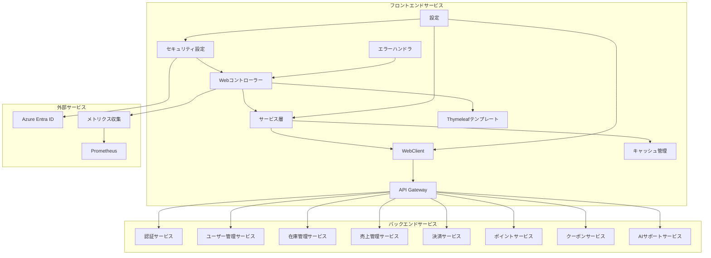
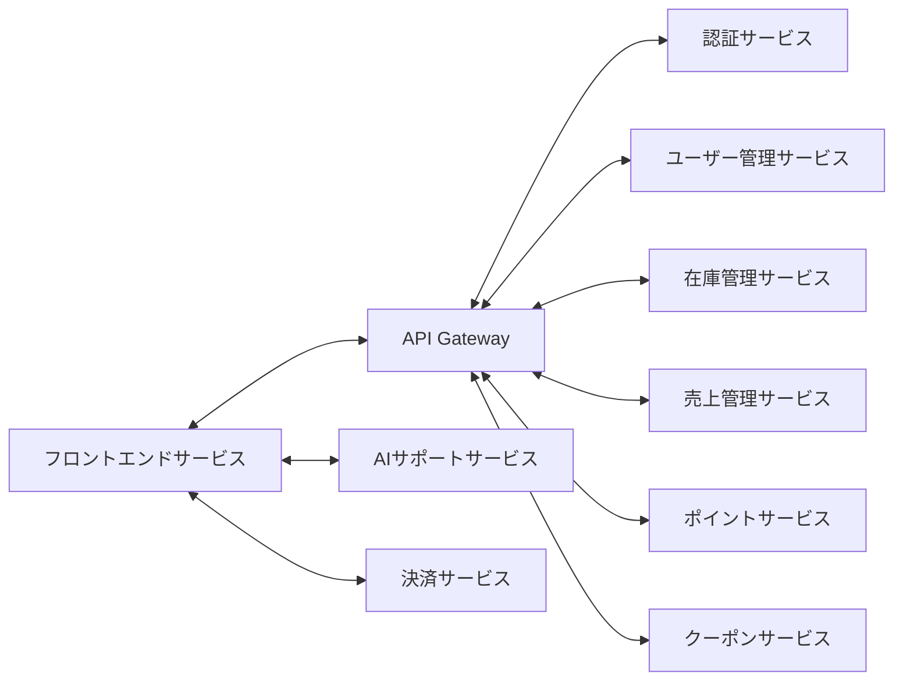

# フロントエンドサービス - 詳細設計ドキュメント

## 1. 概要

フロントエンドサービスは、Azure SkiShopアプリケーションの統合Webユーザーインターフェースを提供するWebアプリケーションです。プレゼンテーション層として、バックエンドのマイクロサービス群と連携し、顧客・管理者の双方にEC体験を提供します。ユーザー操作、商品情報表示、カート管理、管理者向け業務画面などを担当します。

## 2. 技術スタック

### 開発環境
- **言語**: Java 21 (LTS)
- **フレームワーク**: Spring Boot 3.2.0
- **テンプレートエンジン**: Thymeleaf 3.1.x
- **UIフレームワーク**: Bootstrap 5.3.x
- **ビルドツール**: Maven 3.9.x
- **コンテナ**: Docker 25.x
- **テスト**: JUnit 5.10.1, Spring Boot Test, WebMvcTest

### 本番環境
- Azure Container Apps
- Azure Entra ID (OAuth 2.0)
- Azure Application Insights

### 主なライブラリとバージョン
| ライブラリ | バージョン | 用途 |
|------------|------------|------|
| spring-boot-starter-web | 3.2.0 | Web MVCフレームワーク |
| spring-boot-starter-thymeleaf | 3.2.0 | サーバーサイドテンプレート |
| spring-boot-starter-security | 3.2.0 | セキュリティ設定 |
| spring-boot-starter-oauth2-client | 3.2.0 | OAuth 2.0クライアント対応 |
| spring-boot-starter-webflux | 3.2.0 | WebClientによるAPI呼び出し |
| spring-boot-starter-actuator | 3.2.0 | ヘルスチェック・メトリクス |
| spring-boot-starter-cache | 3.2.0 | キャッシュ機能 |
| spring-boot-starter-validation | 3.2.0 | 入力バリデーション |
| thymeleaf-layout-dialect | 3.3.0 | レイアウト管理 |
| bootstrap | 5.3.2 | UIフレームワーク（WebJars）|
| jquery | 3.7.1 | JavaScriptライブラリ（WebJars）|
| font-awesome | 6.4.0 | アイコンライブラリ（WebJars）|
| caffeine | 3.1.8 | 高速キャッシュ |
| httpclient5 | 5.2.1 | WebClient用HTTPクライアント |
| jackson-databind | 2.15.3 | JSON処理 |
| micrometer-registry-prometheus | 1.12.2 | メトリクス収集 |

## 3. システムアーキテクチャ

### コンポーネント構成図

### マイクロサービス関連図

