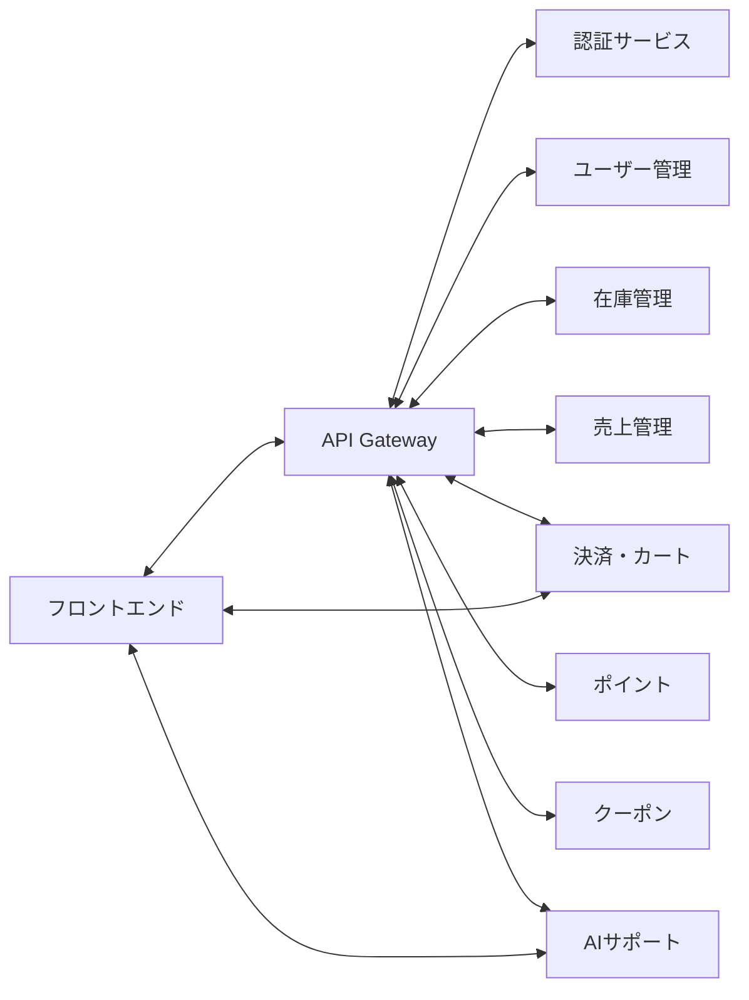

# マイクロサービス関連まとめ

このドキュメントは、design-docs配下のREADMEや設計資料をもとに、システム全体のマイクロサービス構成・連携関係を5分で把握できるようにまとめたものです。

---

## システム全体像
- 本システムはマイクロサービスアーキテクチャを採用し、各業務領域ごとに独立したサービスが連携しています。
- APIゲートウェイが全リクエストの入口となり、認証・認可・ルーティング・監視を一元化。
- 各サービスはREST APIやイベントストリーム（Kafka等）で疎結合に連携。

---

## 主なサービス間連携例
- **API Gateway**：全サービスの入口。認証・認可・ルーティング・API集約。
- **AIサポートサービス**：商品推薦・チャット・検索強化。ユーザー管理、在庫、売上、ポイント等と連携。
- **認証サービス**：ユーザー認証・トークン発行。ユーザー管理やAPI Gatewayと連携。
- **クーポンサービス**：キャンペーン・クーポン発行。注文・決済・ユーザー管理と連携。
- **フロントエンドサービス**：Web UI。API Gateway経由で各サービスと連携。
- **在庫管理・売上管理・決済・ポイント・ユーザー管理**：各業務領域のコアデータ・処理を担当。

---

## 代表的な連携図（例）

---

## 補足
- 各サービスは独立デプロイ・スケールが可能。
- イベント駆動（Kafka等）により非同期連携・拡張性を確保。
- 詳細な設計・API仕様は各サービスのdesign-docs配下に記載。
